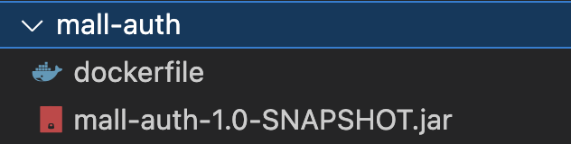
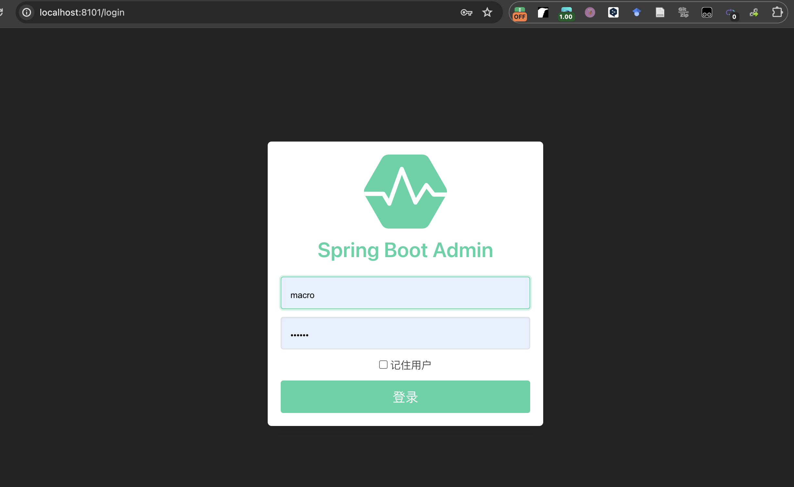
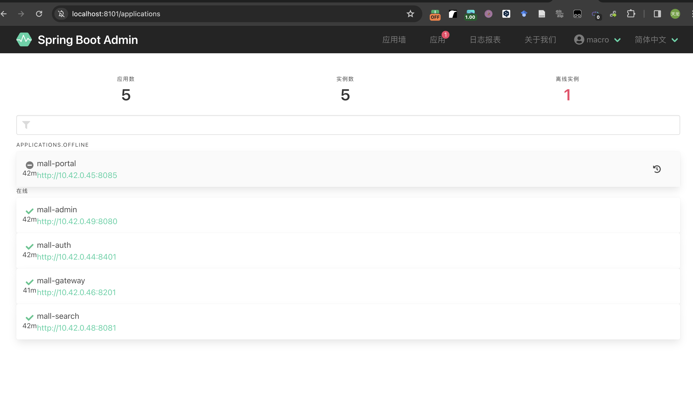
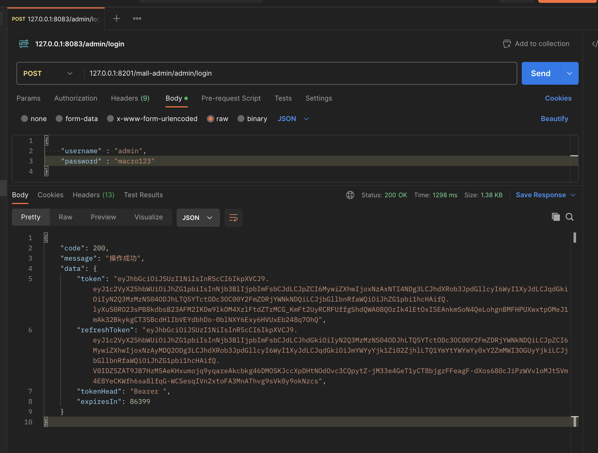
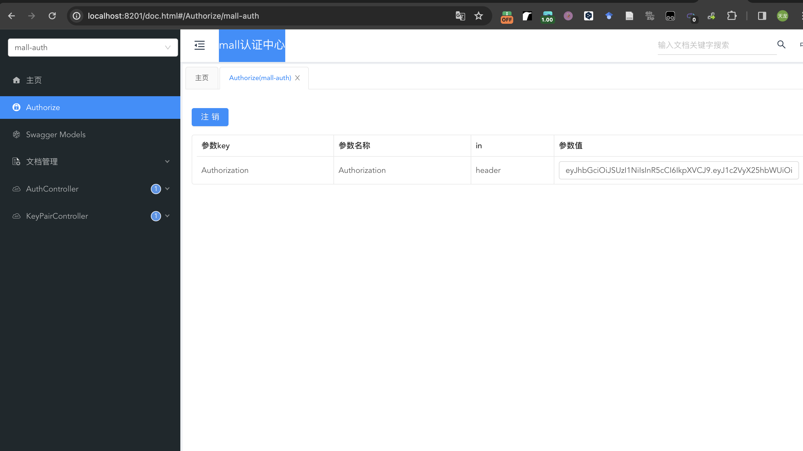

# mall-swarm

原项目链接：
- mall-swarm：https://github.com/macrozheng/mall-swarm
- mall-app-web：https://github.com/macrozheng/mall-app-web

目前此项目只配置了后端 springcloud 项目，没有配置 前端的 vue 项目

## 组织架构

为了快速理解该项目，首先该了解该项目的组织架构：

```
mall
├── mall-common -- 工具类及通用代码模块
├── mall-mbg -- MyBatisGenerator生成的数据库操作代码模块
├── mall-auth -- 基于Spring Security Oauth2的统一的认证中心
├── mall-gateway -- 基于Spring Cloud Gateway的微服务API网关服务
├── mall-monitor -- 基于Spring Boot Admin的微服务监控中心
├── mall-admin -- 后台管理系统服务
├── mall-search -- 基于Elasticsearch的商品搜索系统服务
├── mall-portal -- 移动端商城系统服务
├── mall-demo -- 微服务远程调用测试服务
└── config -- 配置中心存储的配置
```

基础设施清单：

- mysql:5.7
- redis:7
- nginx:1.22
- rabbitmq:3.9-management
- elasticsearch:7.17.3
- logstash:7.17.3
- mongo:4
- minio/minio

## 部署步骤

### 打 jar 包

在根目录下，打项目的jar包

```
mvn install
mvn package
```

### 打 docker 镜像

然后将jar包build成docker，以 mall-auth 为例， `docker build -t xxx/mall-auth::1.0-SNAPSHOT .`



其中 dockerfile 如下：

```
FROM java:8
ADD mall-auth-1.0-SNAPSHOT.jar /mall-tiny-docker-file.jar
RUN bash -c 'touch /mall-tiny-docker-file.jar'
EXPOSE 8401
ENTRYPOINT ["java", "-jar","/mall-tiny-docker-file.jar"]
MAINTAINER wfuing
```

其中，端口的映射关系如下：

- mall-auth：8401
- mall-admin：8080
- mall-gateway：8201
- mall-monitor：8101
- mall-portal：8085
- mall-search：8081

打完 docker 后，将镜像推送到 dockerhub 上，使用 `docker push xxx:xxx`

### 安装 kubevela

请查看官方文档：https://kubevela.io/docs/installation/kubernetes/


### 书写 kubevela 配置文件

这边给出我的配置文件，具体如下：

```yaml
apiVersion: core.oam.dev/v1beta1
kind: Application
metadata:
  name: mall-swarm
  namespace: mall
spec:
  components:
    - name: mysql
      type: webservice
      properties:
        image: mysql:5.7
        ports:
          - port: 3306
            expose: true
        cmd:
          [
            "sh",
            "-c",
            "mysqld --character-set-server=utf8mb4 --collation-server=utf8mb4_unicode_ci",
          ]
        env:
          - name: MYSQL_ROOT_PASSWORD
            value: root
        volumeMounts:
          hostPath:
            - name: volume1 #数据文件挂载
              mountPath: /var/lib/mysql
              path: /mydata/mysql/data/db
            - name: volume2 #配置文件挂载
              mountPath: /etc/mysql/conf.d
              path: /mydata/mysql/data/conf
            - name: volume3 #日志文件挂载
              mountPath: /var/log/mysql
              path: /mydata/mysql/log
      traits:
        - type: scaler
          properties:
            replicas: 1
    - name: redis
      type: webservice
      properties:
        image: redis:7
        ports:
          - port: 6379
            expose: true
        volumeMounts:
          hostPath:
            - name: volume1 #数据文件挂载
              mountPath: /data
              path: /mydata/redis/data
      traits:
        - type: scaler
          properties:
            replicas: 1
    - name: rabbitmq
      type: webservice
      properties:
        image: rabbitmq:3.9-management
        ports:
          - port: 5672
            expose: true
          - port: 15672
            expose: true
        env:
          - name: RABBITMQ_DEFAULT_VHOST
            value: /mall
        volumeMounts:
          hostPath:
            - name: volume1
              mountPath: /var/lib/rabbitmq
              path: /mydata/rabbitmq/data
            - name: volume2
              mountPath: /var/log/rabbitmq
              path: /mydata/rabbitmq/log
      traits:
        - type: scaler
          properties:
            replicas: 1
    - name: elasticsearch
      type: webservice
      properties:
        image: elasticsearch:7.17.3
        ports:
          - port: 9200
            expose: true
        env:
          - name: cluster.name
            value: elasticsearch
          - name: discovery.type
            value: single-node
          - name: ES_JAVA_OPTS
            value: -Xms512m -Xmx1024m
        volumeMounts:
          hostPath:
            - name: volume4
              mountPath: /usr/share/elasticsearch/plugins
              path: /mydata/elasticsearch/plugins
            - name: volume5
              mountPath: /var/lib/elasticsearch/data
              path: /mydata/elasticsearch/data
      traits:
        - type: scaler
          properties:
            replicas: 1
    - name: logstash
      type: webservice
      dependsOn:
        - elasticsearch
      properties:
        image: logstash:7.17.3
        ports:
          - port: 4560
            expose: true
          - port: 4561
            expose: true
          - port: 4562
            expose: true
          - port: 4563
            expose: true
        env:
          - name: TZ
            value: Asia/Shanghai
        volumeMounts:
          hostPath:
            - name: volume1
              mountPath: /usr/share/logstash/pipeline/logstash.conf
              path: /mydata/logstash/logstash.conf
      traits:
        - type: scaler
          properties:
            replicas: 1
    - name: mongo
      type: webservice
      properties:
        image: mongo:4
        # imagePullPolicy: Always
        ports:
          - port: 27017
            expose: true
        volumeMounts:
          hostPath:
            - name: volume1
              mountPath: /data/db
              path: /mydata/mongo/db
      traits:
        - type: scaler
          properties:
            replicas: 1
    - name: nacos-registry
      type: webservice
      properties:
        image: nacos/nacos-server:v2.1.0
        ports:
          - port: 8848
            expose: true
        env:
          - name: MODE
            value: standalone
      traits:
        - type: scaler
          properties:
            replicas: 1
    - name: minio
      type: webservice
      properties:
        image: minio/minio
        ports:
          - port: 9000
            expose: true
          - port: 9001
            expose: true
        args: ["server", "--console-address", ":9001", "/data"]
        volumeMounts:
          hostPath:
            - name: volume1
              mountPath: /data
              path: /mydata/minio/data
        env:
          - name: MINIO_ROOT_USER
            value: minioadmin
          - name: MINIO_ROOT_PASSWORD
            value: minioadmin
      traits:
        - type: scaler
          properties:
            replicas: 1
    - name: mall-auth
      type: webservice
      properties:
        image: september9/mall-auth:1.0-SNAPSHOT
        imagePullPolicy: Always
        ports:
          - port: 8401
            expose: true
        env:
          - name: TZ
            value: Asia/Shanghai
      traits:
        - type: scaler
          properties:
            replicas: 1
    - name: mall-portal
      type: webservice
      dependsOn:
        - mysql
        - nacos-registry
        - mongo
        - redis
        - rabbitmq
      properties:
        image: september9/mall-portal:1.0-SNAPSHOT
        imagePullPolicy: Always
        ports:
          - port: 8085
            expose: true
        env:
          - name: TZ
            value: Asia/Shanghai
      traits:
        - type: scaler
          properties:
            replicas: 1
    - name: mall-gateway
      type: webservice
      dependsOn:
        - nacos-registry
        - redis
      properties:
        image: september9/mall-gateway:1.0-SNAPSHOT
        imagePullPolicy: Always
        ports:
          - port: 8201
            expose: true
        env:
          - name: TZ
            value: Asia/Shanghai
      traits:
        - type: scaler
          properties:
            replicas: 1
    - name: mall-monitor
      dependsOn:
        - nacos-registry
        - mall-search
        - mall-admin
      type: webservice
      properties:
        image: september9/mall-monitor:1.0-SNAPSHOT
        imagePullPolicy: Always
        ports:
          - port: 8101
            expose: true
        env:
          - name: TZ
            value: Asia/Shanghai
      traits:
        - type: scaler
          properties:
            replicas: 1
    - name: mall-search
      type: webservice
      dependsOn:
        - mysql
        - nacos-registry
      properties:
        image: september9/mall-search:1.0-SNAPSHOT
        imagePullPolicy: Always
        ports:
          - port: 8081
            expose: true
        env:
          - name: TZ
            value: Asia/Shanghai
      traits:
        - type: scaler
          properties:
            replicas: 1
    - name: mall-admin
      type: webservice
      dependsOn:
        - mysql
        - nacos-registry
        - minio
        - redis
      properties:
        image: september9/mall-admin:1.0-SNAPSHOT
        imagePullPolicy: Always
        ports:
          - port: 8080
            expose: true
        env:
          - name: TZ
            value: Asia/Shanghai
      traits:
        - type: scaler
          properties:
            replicas: 1
```

在这里要指出的是，如果你需要将 `properties.image` 改成你自己的docker镜像，当然用上面的也行。

上面的配置都采用的 Kubevela 中的 webservice 组件进行定义，如果需要查看 webservice 的文档，可以在命令行输入 `vela show webservice --web` 之后就可以在浏览器中查看文档。

有了配置文件以后，就可以在 kubevela 上进行部署，在上述的 mall-swarm.yaml 文件的目录下执行 `vela up -f mall-swarm.yaml` 即可实现部署。

之后可以在 VelaUX 的可视化界面上查看相关的部署情况，VelaUX 的教程请见官网 https://kubevela.io/docs/reference/addons/velaux/ 。

### 验证部署情况

通过 `vela status -n mall mall-swarm --endpoint` 即可知道所有项目的 DNS 地址，如下：

``` zsh
~$ vela status -n mall mall-swarm --endpoint
Please access mall-swarm from the following endpoints:
+---------+----------------+-----------------------------+-----------------------------+-------+
| CLUSTER |   COMPONENT    |  REF(KIND/NAMESPACE/NAME)   |          ENDPOINT           | INNER |
+---------+----------------+-----------------------------+-----------------------------+-------+
| local   | mysql          | Service/mall/mysql          | mysql://mysql.mall:3306     | true  |
| local   | redis          | Service/mall/redis          | redis://redis.mall:6379     | true  |
| local   | rabbitmq       | Service/mall/rabbitmq       | rabbitmq.mall:5672          | true  |
| local   | rabbitmq       | Service/mall/rabbitmq       | rabbitmq.mall:15672         | true  |
| local   | elasticsearch  | Service/mall/elasticsearch  | elasticsearch.mall:9200     | true  |
| local   | mongo          | Service/mall/mongo          | mongo.mall:27017            | true  |
| local   | nacos-registry | Service/mall/nacos-registry | nacos-registry.mall:8848    | true  |
| local   | minio          | Service/mall/minio          | minio.mall:9000             | true  |
| local   | minio          | Service/mall/minio          | minio.mall:9001             | true  |
| local   | mall-auth      | Service/mall/mall-auth      | mall-auth.mall:8401         | true  |
| local   | logstash       | Service/mall/logstash       | logstash.mall:4560          | true  |
| local   | logstash       | Service/mall/logstash       | logstash.mall:4561          | true  |
| local   | logstash       | Service/mall/logstash       | logstash.mall:4562          | true  |
| local   | logstash       | Service/mall/logstash       | logstash.mall:4563          | true  |
| local   | mall-portal    | Service/mall/mall-portal    | mall-portal.mall:8085       | true  |
| local   | mall-gateway   | Service/mall/mall-gateway   | mall-gateway.mall:8201      | true  |
| local   | mall-search    | Service/mall/mall-search    | mall-search.mall:8081       | true  |
| local   | mall-admin     | Service/mall/mall-admin     | http://mall-admin.mall:8080 | true  |
| local   | mall-monitor   | Service/mall/mall-monitor   | mall-monitor.mall:8101      | true  |
+---------+----------------+-----------------------------+-----------------------------+-------+
```
 
有了 DNS 地址就可以将集群中的内容 port-forward 到 localhost。

#### mysql配置

在上面的部署中，已经将 mysql 的 data 挂载到了本地

首先进入 mysql `vela exec mysql -n mall --  mysql -h mysql.mall -P 3306 --user=root  --password=root`

之后在 mysql 中执行一次 document/sql/mall.sql 即可实现数据挂载。

#### RabbitMQ配置

在配置过程中会遇到一些问题，主要来说还是挂载路径的权限问题，在[RabbitMQ挂载文件权限问题-踩坑经历](https://www.jianshu.com/p/6df642e90b4b)这篇博文中有详细记载。

简单来说，就是修改`log`目录权限

```
sudo chmod 777 mydata/rabbitmq/log
```

然后如果一开始初始化出错，一定要把挂载的路径下的文件全不删除后，再重新启动。

#### port-forward mall-monitor 的地址

在这个项目中可以 port-forward mall-monitor 的地址，可以查看微服务部署的情况。

```zsh
~$ vela port-forward -n mall mall-swarm  8101:8101
? There are 14 services match your filter conditions. Please choose one:
Cluster | Component | Service local | mall-monitor | mall-monitor
trying to connect the remote endpoint svc/mall-monitor 8101:8101 ..Forwarding from 127.0.0.1:8101 -> 8101
Forwarding from [::1]:8101 -> 8101

Forward successfully! Opening browser ...

Failed to open browser: exec: "xdg-open": executable file not found in $PATHHandling connection for 8101
Handling connection for 8101
Handling connection for 8101
Handling connection for 8101
```

在本地的浏览器打开




用户名和密码如下：

- macro
- 123456

进入 mall-monitor 界面，可以监控项目中的微服务。




#### port-forward mall-gateway 的地址

也可以 port-forward mall-monitor 的地址，可以微服务部署的 api。

```zsh
~$ vela port-forward mall-swarm 8201:8201
? There are 14 services match your filter conditions. Please choose one:
Cluster | Component | Service local | mall-gateway | mall-gateway
trying to connect the remote endpoint svc/mall-gateway 8201:8201 ..Forwarding from 127.0.0.1:8201 -> 8201
Forwarding from [::1]:8201 -> 8201

Forward successfully! Opening browser ...

Failed to open browser: exec: "xdg-open": executable file not found in $PATHHandling connection for 8201
Handling connection for 8201
Handling connection for 8201
Handling connection for 8201
```

在浏览器中输入`http://localhost:8201/doc.html` 即可进入。

当然这个项目中使用了 token 验证，可以使用 postman 发送 post 请求



之后可以将这个 token 放到下图的参数值中



之后就可以访问所有微服务的 api，并进行访问，但是注意在访问的时候需要在 header 中加上 `Authorization` ，值为上图中请求返回的 token，即可访问数据库。

